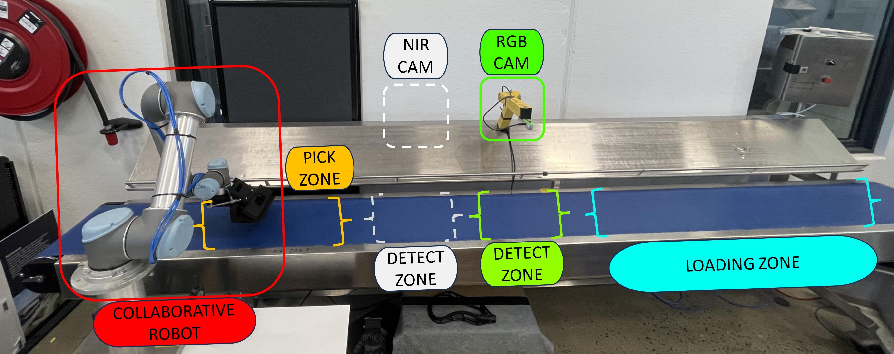
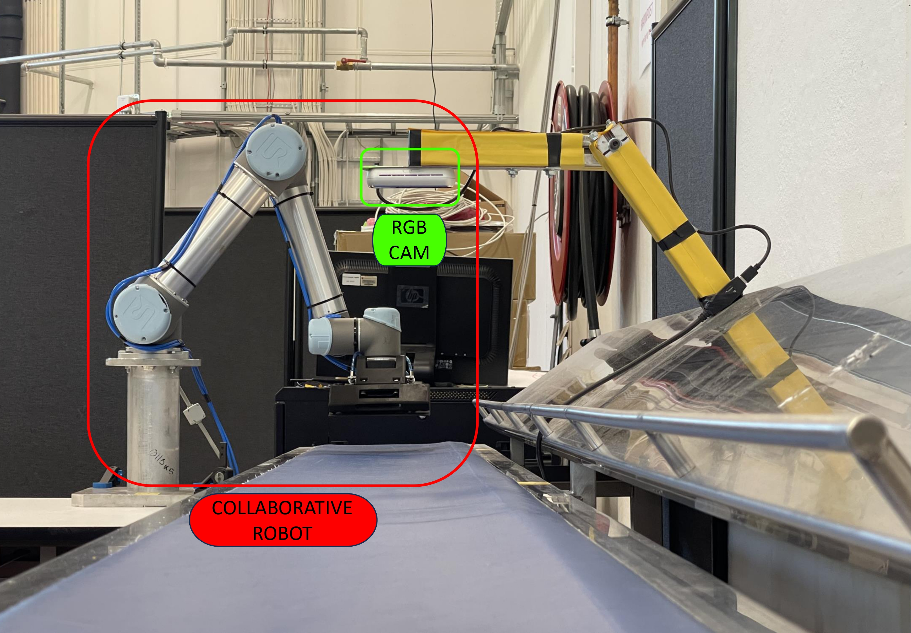
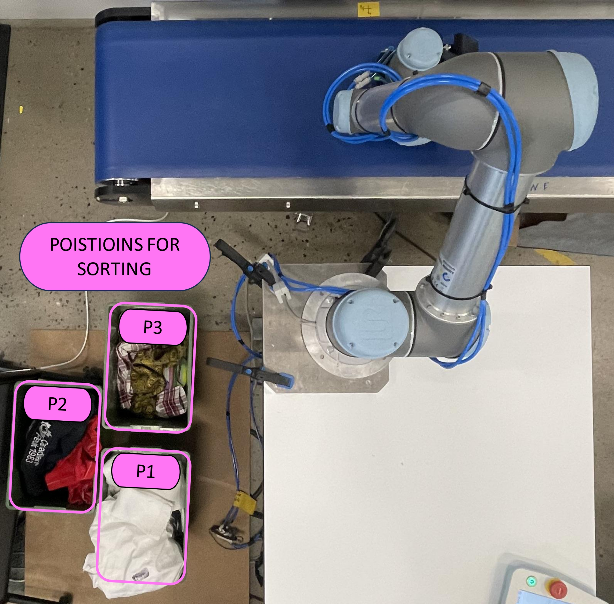
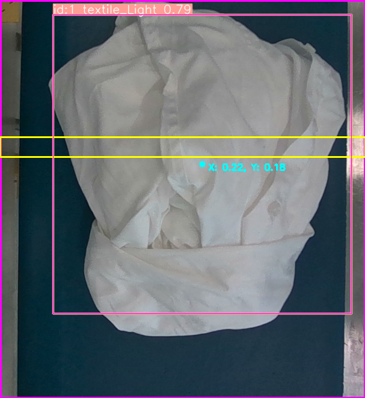

# My master thesis: "Ros2 Based Autonomous Textile Sorting Facility"

A Robot-Cell with perception a system powered by Artificial Intelligence,
Machine Learning, and ROS2 to Classify and Sort Textiles on a Moving
Conveyorbelt

This project is based on the repositories mentioned in acknowledgement, but there has been several changes to simulation URDF with custom work area and gripper. In addition my own scripts are developed such that this multi module facility works in harmony.

# My work:
URDF -> src/multi_robot_arm/urdf/ur/ur5

Project programs -> src/pymoveit2/textilePrograms


## Setup
The pproject is verified with ROS2 Humble.

Dependencies: ROS2 [Humble], moveit2, pymoveit2, Gazebo 11,

# Universal Robots driver setup:
https://github.com/UniversalRobots/Universal_Robots_ROS2_Driver/tree/humble?tab=readme-ov-file


## Clone and Build
```
source /opt/ros/humble/setup.bash

mkdir robot_ws
cd robot_ws
git clone https://github.com/T-BonesLek/ur5_and_sim/tree/main
git clone https://github.com/T-BonesLek/objectDetectionTextile

cd ur5_and_sim
colcon build
source ./install/setup.bash
```
## Launch
Select Simulation or real robot in teh script and run the python script in IDE -> src/pymoveit2/textilePrograms/LaunchTerminals.py

Remember to click play on the pendant when the robot driver node is opened!

## Acknowledgement
pymoveit2 -> https://github.com/AndrejOrsula/pymoveit2

multi_robot_arm -> https://github.com/arshadlab/multi_robot_arm/tree/master


# Media
The system in action -> https://youtu.be/An8Itexof-E



